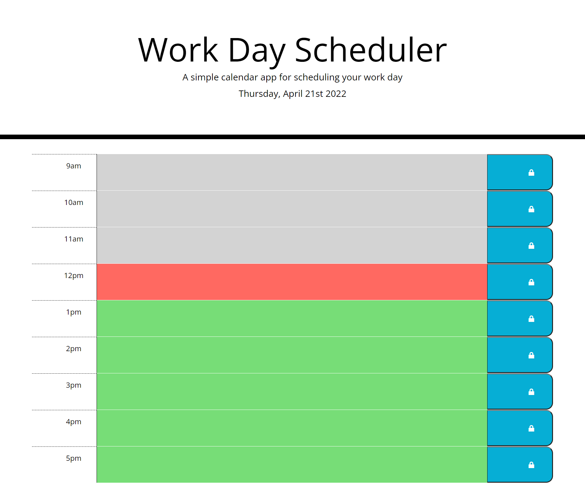

# **Work Day Scheduler**

## **Overview**
The purpose of this project was to create a webpage containing a work day calendar where users could organize their daily schedule by the hour. The User Story and Acceptance Criteria are as follows:

### **User Story**
> AS AN employee with a busy schedule 
I WANT to add important events to a daily planner 
SO THAT I can manage my time effectively

### **Acceptance Criteria**
> GIVEN I am using a daily planner to create a schedule 
WHEN I open the planner 
THEN the current day is displayed at the top of the calendar 
WHEN I scroll down 
THEN I am presented with time blocks for standard business hours 
WHEN I view the time blocks for that day 
THEN each time block is color-coded to indicate whether it is in the past, present, or future 
WHEN I click into a time block 
THEN I can enter an event 
WHEN I click the save button for that time block 
THEN the text for that event is saved in local storage 
WHEN I refresh the page 
THEN the saved events persist 

## **Assets Utilized** 

- index.html
- style.css
- script.js

## **Built With**

* HTML
* CSS
* JavaScript
* jQuery
* Moment.js

## **Deliverable**

**Work Day Scheduler:** 
https://sd-github21.github.io/weekday-planner/

**Screen Shot of Work Day Scheduler:** 
 

